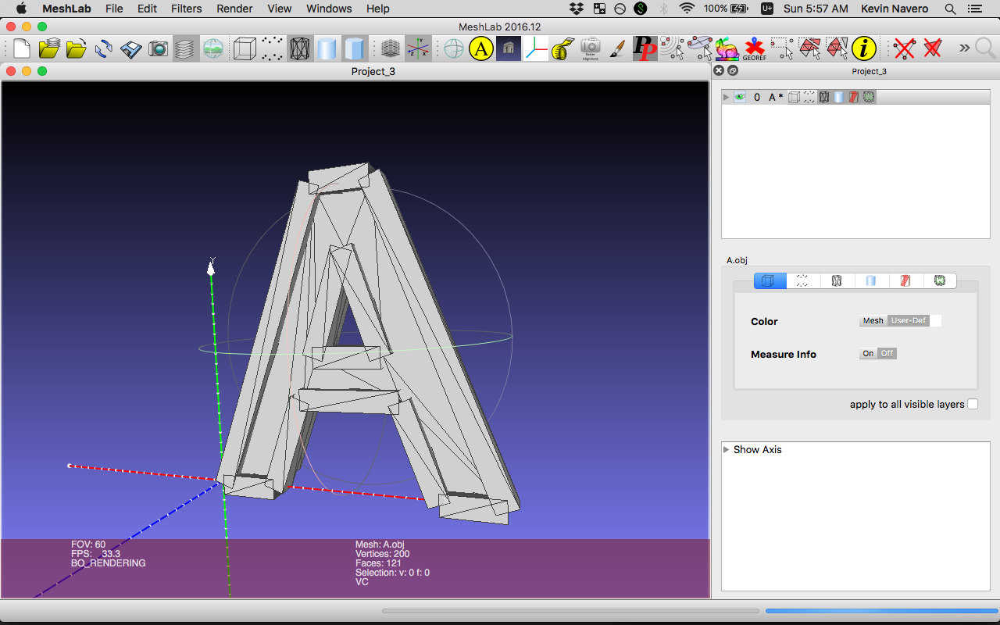

# FontExtract

## Description

Extract glyphs from ttf and create .obj

## Build

Tested on OSX, 10.11.6 at the oldest. Open FontExtract/FontExtract.sln in Visual Studio Community and hit Command + K to build.

## Usage

**Warning**: --xoffset is *not yet implemented*

**Warning**: --yoffset is *not yet implemented*

Hopefully the help description below will suffice. If it does not, then let me know.

```
usage: FontExtract [OPTIONS]+ TTF

convert .ttf glyphs to .obj

positional arguments:
  TTF                        path to .ttf file

optional arguments:
  -c, --char=VALUE           specify a glyph by codepoint to convert to .obj. 
                               Exit 1 if VALUE is not a single character. If 
                               not specified, defaults to all glyphs in the tt-
                               f. This can stack
      --front-only           generate a .obj for the front face only
      --side-only            generate a .obj for the side face only
  -l, --list-names           list glyph names
  -p, --print                print .obj to console
  -d, --dry-run              do not write to .obj. Useful with -p if printing 
                               to console is the only requirement
  -s, --size=VALUE           size in points (1/72 of 1 inch). Defaults to 30-
                               0. Exit 1 if VALUE is not a valid floating point
  -x, --xoffset=VALUE        translate the model VALUE units across the x 
                               axis. Exit 1 if VALUE is a non-integer
  -y, --yoffset=VALUE        translate the model VALUE units across the y 
                               axis. Exit 1 if VALUE is a non-integer
  -z, --zdepth=VALUE         depth of the extrusion VALUE units across the z 
                               axis. Defaults to 50. Exit 1 if VALUE is a non-
                               integer
  -t, --thickness-outline    thickness of outline in VALUE units. Defaults to 
                               20
  -h, --help                 show this message and exit
```

## Example

```
$ cd path/to/FontExtract/FontExtract/bin/Debug
$ mono FontExtract.exe -c A -s 300 ../../../FontExtractTest/Resources/Alef-Bold.ttf
```

an A.obj will be written to the current directory. Opening it up in meshlab looks something like...



## TODO

- x-offset, y-offset
- side-only, front-only dump .obj in one shot (as opposed to being mutually exclusive)
- refactor prismoid class
- miter joints

